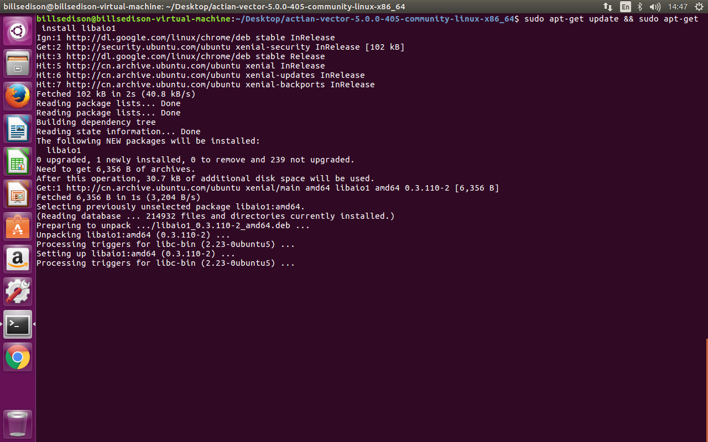
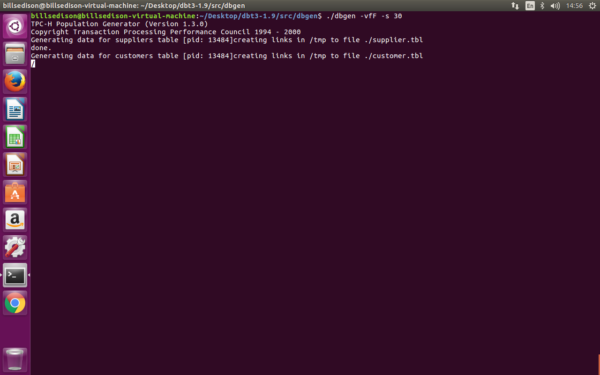
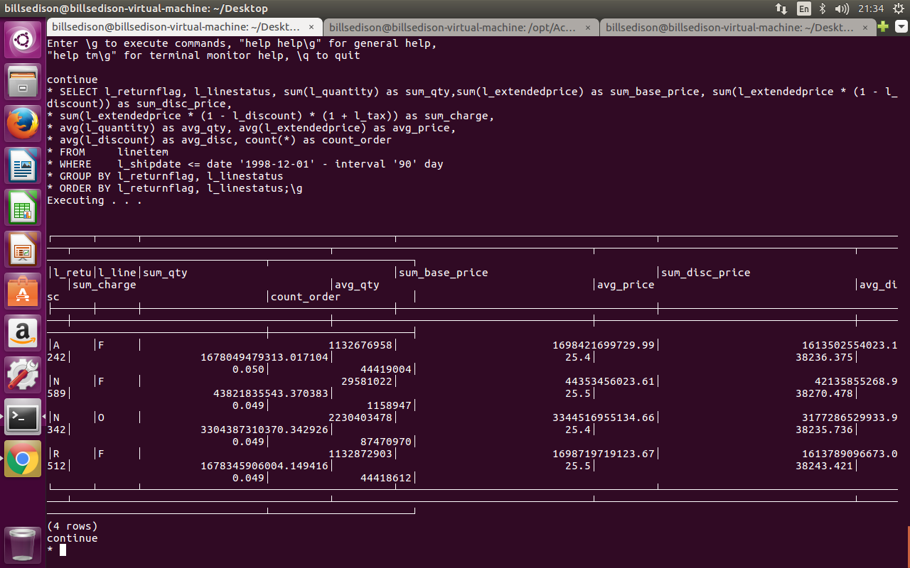

Actain Setup Documentation
=============================

## Working Environment

Ubuntu 16.04 VMWare on macOSX

## Installation

### 1. Install dependencies

```
sudo apt-get update && sudo apt-get install libaio1
```


### 2. Install Actian Vector

Download the Actian Vector from [here](http://esdcdn.actian.com/Vector/5.0/Community/a64.lnx/actian-vector-5.0.0-405-community-linux-x86_64.tgz)

Then unzip it and install it
```
sudo ./install.sh -user <your user name>
```


### 3. Set environment

Set environment variable by
```
. /home/<your user name>/.ingVWsh
```

And also make sure the virtual address allocation is unlimited


### 4. Start the vector

Type the following command
```
ingstart
```

to start the vector


## Generate DBT-3 Benchmark data

1. Download [DBT-3 Benchmark script](http://downloads.sourceforge.net/project/osdldbt/dbt3/1.9/dbt3-1.9.tar.gz) and uncompress it.

2. Switch the directory to `dbt3-1.9/src/dbgen` and then type `make` to build `dbgen`.


3. Then type
```
./dbgen -vfF -s 30
```
to generate the 30GB data


When it is done, you will find a file `lineitem.tbl` in your directory.


## Create table and Load DBT-3 Benchmark data

### 1. Create table

Type the following commands to create database `dbtest`
```
createdb dbtest
```
Then type
```
sql dbtest
```
and in the interactive shell, create the table `lineitem` by
```
CREATE TABLE lineitem (
        l_orderkey INTEGER NOT NULL,
        l_partkey INTEGER NOT NULL,
        l_suppkey INTEGER NOT NULL,
        l_linenumber INTEGER NOT NULL,
        l_quantity DECIMAL(2,0) NOT NULL,
        l_extendedprice DECIMAL(8,2) NOT NULL,
        l_discount DECIMAL(2,2) NOT NULL,
        l_tax DECIMAL(2,2) NOT NULL,
        l_returnflag CHAR(1) NOT NULL,
        l_linestatus CHAR(1) NOT NULL,
        l_shipdate ANSIDATE NOT NULL,
        l_commitdate ANSIDATE NOT NULL,
        l_receiptdate ANSIDATE NOT NULL,
        l_shipinstruct CHAR(25) NOT NULL,
        l_shipmode CHAR(10) NOT NULL,
        l_comment VARCHAR(44) NOT NULL);\g
```


### 2. Load data
Switch the directory to `dbt3-1.9/src/dbgen` then type
```
vwload --verbose --table lineitem --fdelim "|" dbtest lineitem.tbl 
```
to load the data.

It takes me ~20 minutes, the flag `--verbose` is used to show the progress and tell me it is running well during the long and tedious wating time.


When the data load is completed, it shows the summanry info.


### 3. Create Statistics

Run the following command to create statistics, which helps to optmize query.

```
optimizedb -zns dbtest
```

It also may take long time since we loaded ~30GB data.

## Run the report query

Back to the interactive shell (invoked by `sql dbtest`) and run
```
SELECT l_returnflag, l_linestatus, sum(l_quantity) as sum_qty,sum(l_extendedprice) as sum_base_price, sum(l_extendedprice * (1 - l_discount)) as sum_disc_price,
sum(l_extendedprice * (1 - l_discount) * (1 + l_tax)) as sum_charge,
avg(l_quantity) as avg_qty, avg(l_extendedprice) as avg_price,
avg(l_discount) as avg_disc, count(*) as count_order
FROM     lineitem
WHERE    l_shipdate <= date '1998-12-01' - interval '90' day
GROUP BY l_returnflag, l_linestatus
ORDER BY l_returnflag, l_linestatus; \g
```

Then I get the following query result


